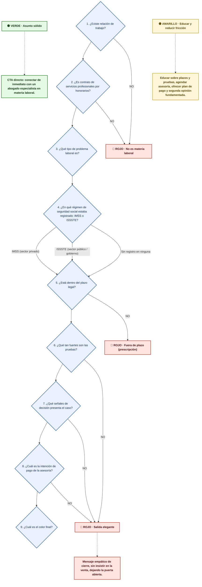

# Árbol de Decisión — Semáforo Legal Laboral (iUS)

Generado por `scripts/build_ius_arbol_decision.py` desde `docs/ius_legal_config.json`. No editar a mano: regenerá el documento con el script.

## Leyenda

|Nodo|Significado|
|---|---|
|Entrada|Datos que ya trae la conversación (state_vars)|
|Pregunta|Paso de evaluación del árbol|
|🟢 Verde|Asunto sólido: en tiempo, con pruebas y con disposición a pagar|
|🟡 Amarillo|Zona de riesgo: educar y reducir fricción|
|🔴 Rojo|Descartado: cierre empático, sin insistir en la venta|

## Árbol

## Pasos

| Nº | Pregunta | Criterio | Datos | Nodos del flow | Resultado |
|---|---|---|---|---|---|
| 1 | ¿Existe relación de trabajo? | Trabajo personal + subordinación + salario (contrato escrito o acuerdo verbal). Cualquiera de los tres ausente = no laboral. | contrato (escrito \| verbal \| ninguno); funciones_confianza (si \| no \| indefinido) | validacion_tema, exploracion_tema | NO → 🔴 ROJO · No es materia laboral (casa, delito, divorcio, visitas u otro tema ajeno al trabajo) |
| 2 | ¿Es contrato de servicios profesionales por honorarios? | Honorarios reales = medios propios, cédula profesional, objeto claro, sin horario fijo ni instrucciones → no laboral. Si hay subordinación real es simulación: se evalúa como relación de trabajo. | contrato_honorarios (si \| no \| indefinido); simulacion (si \| no \| no_aplica) | validacion_honorarios, validacion_simulacion_honorarios | NO → 🔴 ROJO · No es materia laboral (honorarios reales sin subordinación) |
| 3 | ¿Qué tipo de problema laboral es? | 13 tipos: despido injustificado, firma de documento, reducción de sueldo, cambio de ubicación, accidente laboral, investigación, no renovación de contrato, acoso u hostigamiento, retiro de insumos, congelamiento de funciones, declaración de beneficiarios, prima de antigüedad (más de 15 años), problema de pensión. | tipo_problema (despido_injustificado \| firma_documento \| reduccion_sueldo \| cambio_ubicacion \| accidente_laboral \| investigacion \| no_renovacion \| acoso \| retiro_insumos \| congelamiento_funciones \| beneficiarios \| prima_antiguedad \| problemas_pension) | clasificacion_problema | → regimen |
| 4 | ¿En qué régimen de seguridad social estaba registrado: IMSS o ISSSTE? | Se pregunta por las dos opciones, nunca como un sí/no: cada respuesta abre un camino independiente con su propia ley y su propio plazo. IMSS → LFT (Apartado A). ISSSTE → LFTSE (Apartado B). Sin registro en ninguna → se evalúa como informal registrado o no según documentación, con el mismo plazo de 2 meses. No alcanza con saber que tuvo seguridad social: hay que saber en cuál. | institucion (IMSS \| ISSSTE \| ninguna) | validacion_institucion | IMSS (sector privado) → plazo (LFT (Apartado A del Art. 123) · 0-40 favorable / 41-60 límite / 61+ prescripción) · ISSSTE (sector público / gobierno) → plazo (LFTSE (Apartado B del Art. 123) · 0-90 favorable / 91-120 límite / 121+ prescripción) · Sin registro en ninguna → plazo (se evalúa como informal registrado o no según documentación · el plazo de 2 meses del Art. 518 LFT corre igual (0-40 / 41-60 / 61+): la informalidad no exime de la prescripción) |
| 5 | ¿Está dentro del plazo legal? | Días naturales desde la desvinculación: IMSS 0-40 favorable / 41-60 límite / 61+ prescripción; ISSSTE 0-90 / 91-120 / 121+; sin registro en IMSS ni ISSSTE (informal) 0-40 / 41-60 / 61+ (Art. 518 LFT). La solicitud de conciliación interrumpe el plazo y se retoma al día siguiente de la Constancia de No Conciliación. | fecha_desvinculacion (fecha (AAAA-MM-DD) o descripción relativa); tiempo_transcurrido (pocos_dias \| una_a_tres_semanas \| uno_a_dos_meses \| seis_siete_semanas \| catorce_quince_semanas \| mas_de_dos_meses \| mas_de_120_dias (ver priority.umbrales)); conciliacion (objeto {solicitud: fecha\|no, constancia_no_conciliacion: fecha\|no}) | validacion_urgencia, advertencia_plazo, advertencia_plazo_vencido | NO → 🔴 ROJO · Fuera de plazo (prescripción) (más de 60 días (IMSS o sin registro patronal) o más de 120 días (ISSSTE), sin interrupción por conciliación) |
| 6 | ¿Qué tan fuertes son las pruebas? | Bloque derivado de state_vars por matriz_documentacion: fuerte / media / débil / sin pruebas. Sin pruebas → rojo. | copia_contrato (si \| no); recibos_nomina (si \| parcial \| no); documentos_indicaciones (si \| no); grabacion (si \| no); testigos (0 \| 1_o_2 \| 3_o_mas); alta_imss_issste (si \| no \| no_sabe); documentacion (con_documentacion \| documentacion_parcial \| sin_documentacion); comprobantes_prestaciones (si \| no) | filtro_calidad, validacion_contrato, validacion_copia_contrato, validacion_recibos_nomina, validacion_comprobantes_prestaciones, validacion_documentos_indicaciones | NO → 🔴 ROJO · Salida elegante (sin pruebas: ningún elemento acredita la relación laboral (matriz_documentacion: SIN PRUEBAS)) |
| 7 | ¿Qué señales de decisión presenta el caso? | Positivas (sin renuncia firmada, sin hojas en blanco, sin liquidación pagada, con recibos, con correos u oficios, con horario fijo), límite (sin contrato, sin motivo explicado, pago mixto, sin horario fijo) o negativas (firmó hojas en blanco, pago en efectivo, sin horario fijo, no quiere demandar). Las negativas empujan a rojo. | hojas_en_blanco (si \| no); liquidacion_pagada (si \| no \| no_aplica); motivo_explicado (si \| no); horario_fijo (si \| no \| indefinido); forma_pago (nomina \| efectivo \| mixto \| otro); renuncia_huella_voluntaria (si \| no); promesa_liquidacion_incumplida (si \| no \| no_aplica) | validacion_renuncia_huella, validacion_forma_pago, validacion_periodo, validacion_funciones_confianza, validacion_promesa_liquidacion | NO → 🔴 ROJO · Salida elegante (señales negativas: firmó hojas en blanco, pago en efectivo, sin horario fijo o no quiere demandar) |
| 8 | ¿Cuál es la intención de pago de la asesoría? | Se evalúa por señales, nunca preguntando directamente. Alta / duda / rechazo. El rechazo persistente cierra en rojo. | intencion_pago (alta \| duda \| rechazo) | propuesta_conversion, mas_informacion | NO → 🔴 ROJO · Salida elegante (rechazo persistente a pagar la asesoría después de un intento de manejar la objeción) |
| 9 | ¿Cuál es el color final? | Cruce de tiempo + pruebas + pago según priority.reglas (la más específica tiene precedencia). En tiempo + con pruebas + dispuesto a pagar = verde. Tiempo aceptable + faltan documentos o duda de pago = amarillo. Fuera de tiempo, sin pruebas o rechazo de pago = rojo. | tiempo_transcurrido (pocos_dias \| una_a_tres_semanas \| uno_a_dos_meses \| seis_siete_semanas \| catorce_quince_semanas \| mas_de_dos_meses \| mas_de_120_dias (ver priority.umbrales)); documentacion (con_documentacion \| documentacion_parcial \| sin_documentacion); intencion_pago (alta \| duda \| rechazo) | — | — (salida del árbol) |

## Plazos legales

Conteo: días naturales (lunes a domingo).

| Institución | Ley | Plazo total | Favorable | Límite | Prescripción |
|---|---|---|---|---|---|
| IMSS (sector privado) | LFT (Apartado A del Art. 123) | 60 días naturales | 0-40 | 41-60 | 61+ |
| ISSSTE (sector público) | LFTSE (Apartado B del Art. 123) | 120 días naturales | 0-90 | 91-120 | 121+ |
| Sin registro (informal) | LFT (Art. 518) — sin alta en IMSS ni ISSSTE | 60 días naturales | 0-40 | 41-60 | 61+ |

**Sin registro patronal:** La falta de registro patronal no suspende ni amplía el plazo: la informalidad no exime de la prescripción de 2 meses.

**Interrupción del plazo:** El plazo se interrumpe al ingresar la solicitud de conciliación ante el Centro Federal o Local de Conciliación Laboral y se retoma al día siguiente de la emisión de la Constancia de No Conciliación.

**Otros plazos:** separacion_causa_justificada_meses = 1; riesgo_de_trabajo_anios = 2; declaracion_beneficiarios_anios = 2; prima_antiguedad_anios = 1

**Instrucción de cómputo:** Convertí la fecha de desvinculación a días naturales transcurridos (hoy - fecha) y ubicá el caso en favorable / limite / prescripcion con la banda del régimen del usuario (imss / issste / sin_registro). Si la fecha no está, pedila antes de clasificar.

## Matriz de documentación

El bloque se deriva de state_vars; no se pregunta aparte.

| Bloque | Color | Criterio |
|---|---|---|
| FUERTE | 🟢 VERDE | copia_contrato=si ∧ recibos_nomina=si ∧ documentos_indicaciones=si ∧ grabacion=si ∧ testigos=3_o_mas ∧ alta_imss_issste=si |
| MEDIO | 🟡 AMARILLO | copia_contrato=si ∧ recibos_nomina=si ∧ documentos_indicaciones=si |
| DÉBIL | 🟡 AMARILLO | (testigos=3_o_mas ∨ documentos_indicaciones=si) ∧ copia_contrato=no ∧ recibos_nomina=no |
| SIN PRUEBAS | 🔴 ROJO | copia_contrato=no ∧ recibos_nomina=no ∧ documentos_indicaciones=no ∧ testigos=0 ∧ alta_imss_issste=no |

## Señales de decisión

Ajustan el color cuando priority.reglas deja el caso en amarillo. Las negativas empujan a rojo.

**Señales positivas**

| Señal | Condición |
|---|---|
| No le explicaron el motivo de la terminación | `motivo_explicado=no` |
| No firmó renuncia ni hojas en blanco | `hojas_en_blanco=no ∧ renuncia_huella_voluntaria=no` |
| No le pagaron liquidación ni finiquito | `liquidacion_pagada=no` |
| Tiene recibos de nómina | `recibos_nomina=si` |
| Tiene correos, oficios o grabaciones | `documentos_indicaciones=si ∨ grabacion=si` |
| Tenía horario fijo | `horario_fijo=si` |

**Señales límite**

| Señal | Condición |
|---|---|
| No cuenta con contrato de trabajo | `contrato=ninguno` |
| No le explicaron el motivo de la terminación | `motivo_explicado=no` |
| Salario mitad con recibo y mitad en efectivo | `forma_pago=mixto` |
| No tenía horario fijo | `horario_fijo=no` |

**Señales negativas**

| Señal | Condición |
|---|---|
| Firmó hojas en blanco al ingresar | `hojas_en_blanco=si` |
| Su pago era en efectivo | `forma_pago=efectivo` |
| No tenía horario fijo | `horario_fijo=no` |
| No quiere demandar | `intencion_pago=rechazo` |
| No está dispuesto a pagar la asesoría | `intencion_pago=rechazo` |

## Intención de pago

Evaluá por señales del usuario; nunca preguntes directamente si puede pagar. Precio de referencia: **$2,500 MXN** (`config.precio_asesoria_mxn`).

| Nivel | Señales | Acción |
|---|---|---|
| alta | quiero demandar ya; me urge contactar con un abogado; cuento con los medios económicos para pagar; me interesa pagar la asesoría | Ir directo al cierre; no demorar con preguntas innecesarias. |
| duda | solo quiero saber; no tengo dinero ahora; la asesoría me parece costosa; no estoy convencido de demandar | Manejar la objeción específica (precio, desconfianza o duda de demandar) y reducir fricción con plan de pago. |
| rechazo | no pienso pagar; no estoy acostumbrado a pagar por asesoría legal; ya me dijo otro abogado que mi asunto es fácil | Un intento de manejar la objeción de precio; si persiste el rechazo, cerrar en rojo. |

## Semáforo final y acciones

La acción de cierre la define el color. El texto sale del nodo del flow: no dupliques copy acá.

| Color | Acción de cierre | Nodo del flow |
|---|---|---|
| 🟢 VERDE | CTA directo: conectar de inmediato con un abogado especialista en materia laboral. | captura_datos |
| 🟡 AMARILLO | Educar sobre plazos y pruebas, agendar asesoría, ofrecer plan de pago y segunda opinión fundamentada. | mas_informacion |
| 🔴 ROJO | Mensaje empático de cierre, sin insistir en la venta, dejando la puerta abierta. | cierre_sin_conversion |

## Descarte inmediato

Si se cumple cualquiera de estos criterios, el caso es ROJO y no se continúa el flujo de conversión.

| Criterio | Regla |
|---|---|
| Fuera del plazo legal (prescripción) | `imss_mas_dos_meses \| issste_mas_de_120_dias \| sin_institucion_mas_dos_meses` |
| Sin relación laboral comprobable | `sin_institucion_sin_docs \| sin_pruebas` |
| Hechos irreales o incongruentes | `hechos_no_veridicos` |
| Usuario conflictivo o de mala fe | `usuario_conflictivo` |
| No quiere pagar la asesoría | `rechazo_pago_persistente` |

## Reglas de calificación

Se recorren en orden ascendente de `precedencia`: la primera cuyos filtros y condición se cumplan define el color. El orden resuelve la precedencia entre reglas que empatan.

| # | Regla | Color | Condiciones | Pendiente de validación legal | Texto |
|---|---|---|---|---|---|
| 1 | `embarazo_discriminacion` | 🟢 VERDE | institucion = cualquiera; condición: embarazo o condicion protegida mencionada como motivo o contexto de la terminacion; tiempo_transcurrido = cualquiera | — | Terminación vinculada a embarazo u otra condición protegida (discriminación). No aplica el corte por plazo: la acción es de nulidad y el plazo no corre. Requiere que el usuario mencione el embarazo/condición como motivo o contexto de la terminación. Color VERDE. |
| 2 | `tema_no_laboral` | 🔴 ROJO | institucion = sin dato; tiempo_transcurrido = sin dato; periodo_trabajado = sin dato; condición: el tema planteado no corresponde a una relación de trabajo (pensiones, divorcios, disputas civiles u otros) | — | El tema planteado no corresponde a una relación laboral (pensiones, disputas civiles, etc.). Fuera del alcance del agente. |
| 3 | `fuera_de_jurisdiccion` | 🔴 ROJO | institucion = sin dato; tiempo_transcurrido = sin dato; periodo_trabajado = sin dato; condición: la relación laboral ocurrió fuera de México o bajo otra jurisdicción | — | La relación laboral ocurrió fuera de México o bajo otra jurisdicción. El agente no puede orientar este tipo de caso. |
| 4 | `hechos_no_veridicos` | 🔴 ROJO | institucion = cualquiera; periodo_trabajado = cualquiera; tiempo_transcurrido = cualquiera; condición: relato con hechos contradictorios entre sí o manifiestamente inverosímiles (fechas o montos incompatibles, versiones que se desmienten) | sí | El relato no es verosímil o se contradice. No hay caso defendible que registrar. Color ROJO. |
| 5 | `usuario_conflictivo` | 🔴 ROJO | institucion = cualquiera; periodo_trabajado = cualquiera; tiempo_transcurrido = cualquiera; condición: hostilidad, amenazas o mala fe manifiesta del usuario hacia el agente o el despacho | sí | Usuario conflictivo o de mala fe. Color ROJO, con cierre cortés. |
| 6 | `rechazo_pago_persistente` | 🔴 ROJO | institucion = cualquiera; periodo_trabajado = cualquiera; tiempo_transcurrido = cualquiera; intencion_pago = rechazo; condición: el rechazo a pagar la asesoría (config.precio_asesoria_mxn) persiste después de un intento de manejar la objeción de precio | sí | El usuario no está dispuesto a pagar la asesoría y mantiene el rechazo. Color ROJO: cierre empático, sin insistir en la venta. |
| 7 | `sin_pruebas` | 🔴 ROJO | institucion = cualquiera; periodo_trabajado = cualquiera; tiempo_transcurrido = cualquiera; copia_contrato = no; recibos_nomina = no; documentos_indicaciones = no; testigos = 0; alta_imss_issste = no | sí | No hay ningún elemento que acredite la relación laboral ni sus condiciones (matriz_documentacion: SIN PRUEBAS). Color ROJO. |
| 8 | `imss_mas_dos_meses` | 🔴 ROJO | institucion = IMSS; tiempo_transcurrido = mas_de_dos_meses (Más de dos meses (61+ días)); periodo_trabajado = cualquiera | — | IMSS registrado pero desvinculado hace más de dos meses. El plazo de prescripción de 2 meses (Art. 518 LFT) para acciones de reinstalación e indemnización constitucional ha vencido. Esta regla aplica aunque haya liquidación pendiente, documentación perfecta o alta antigüedad. La reclamación de salarios caídos ya no es viable en estos plazos. Color ROJO, sin excepción. |
| 9 | `issste_mas_de_120_dias` | 🔴 ROJO | institucion = ISSSTE; periodo_trabajado = cualquiera; tiempo_transcurrido = mas_de_120_dias (Más de 120 días (121+ días)) | sí | Trabajador del sector público (ISSSTE) separado hace más de 120 días naturales (4 meses). El plazo de prescripción de plazos_legales.issste está vencido, salvo interrupción por solicitud de conciliación. Color ROJO, sin excepción. |
| 10 | `sin_institucion_mas_dos_meses` | 🔴 ROJO | institucion = ninguna; tiempo_transcurrido = mas_de_dos_meses (Más de dos meses (61+ días)); periodo_trabajado = cualquiera | — | Sin registro en institución (trabajadora del hogar, informal, cuenta propia sin contrato) y desvinculada hace más de dos meses. Aunque tenga testigos o documentación parcial, el plazo de prescripción de 2 meses (Art. 518 LFT) ya venció. La informalidad no exime del plazo de prescripción. Color ROJO. |
| 11 | `sin_institucion_sin_docs` | 🔴 ROJO | institucion = ninguna; tiempo_transcurrido = cualquiera; periodo_trabajado = cualquiera; documentacion = sin_documentacion | — | Sin registro en institución y sin documentación que acredite la relación laboral. Caso de baja viabilidad. |
| 12 | `interinato_sindical` | 🔴 ROJO | institucion = cualquiera; tiempo_transcurrido = cualquiera; periodo_trabajado = cualquiera; condición: cubrió temporalmente la plaza de un titular sindicalizado que se reincorpora: la terminación es el fin natural del interinato | — | Trabajador que cubrió temporalmente la plaza de un titular sindicalizado que estaba en comisión, licencia, incapacidad o permiso y que ha regresado a ocupar su plaza. La terminación es el fin natural del interinato, no un despido injustificado. El interino no adquiere derechos de permanencia ni titularidad sobre la plaza del titular sindicalizado. La demanda de titularidad de la plaza no es procedente. Color ROJO. |
| 13 | `personal_confianza_sector_publico` | 🔴 ROJO | institucion = ISSSTE; funciones_confianza_reales = si; evaluar: funciones_reales; tiempo_transcurrido = cualquiera; periodo_trabajado = cualquiera | — | Personal del sector público removido de una plaza de confianza. Aplica SOLO si las FUNCIONES REALES eran de confianza: dirección, mando, manejo de recursos, representación o asesoría directa del titular. NO aplica por la sola etiqueta del nombramiento ("catalogado de confianza"): si el usuario describe funciones operativas o técnicas (atención al público, trámites, estudios socioeconómicos, trabajo de campo), evaluar el caso con las demás reglas. Cuando aplica: Color ROJO. |
| 14 | `issste_renuncia_impugnada_con_evidencia` | 🟡 AMARILLO | institucion = ISSSTE; tiempo_transcurrido = cualquiera; periodo_trabajado = cualquiera; firmo_renuncia = si | — | Trabajador del sector público (ISSSTE) que firmó una renuncia pero la impugna porque: (1) fue firmada bajo presión, coacción o cambio forzado de adscripción con plazos irrazonables, Y (2) existe evidencia documental de retractación oportuna (antes de que surtiera efecto), como correo electrónico oficial con confirmación de leído, escrito entregado a RH, o notificación formal. La renuncia puede ser anulable por vicio del consentimiento. El caso es viable aunque complicado. Color AMARILLO. |
| 15 | `renuncia_con_promesa_liquidacion_incumplida` | 🟢 VERDE | institucion = cualquiera; condición: el patrón no cumplió la liquidación prometida a cambio de la renuncia (basta que la promesa haya existido y no se haya pagado), o el usuario se retractó o impugnó por escrito; tiempo_transcurrido = pocos_dias (Pocos días (0-7 días)) \| una_a_tres_semanas (Una a tres semanas (8-21 días)); firmo_renuncia = si; promesa_liquidacion_incumplida = si | — | El usuario firmó una renuncia, pero el patrón no cumplió la liquidación o el pago prometido a cambio (o el usuario se retractó/impugnó por escrito), el caso está dentro de plazo y cuenta con documentación completa (contrato, recibos, prestaciones). Vicio del consentimiento: el caso es reclamable. Color VERDE. |
| 16 | `imss_seis_siete_semanas_renuncia_huella_voluntaria` | 🟡 AMARILLO | institucion = IMSS; renuncia_huella_voluntaria = si; tiempo_transcurrido = seis_siete_semanas (Seis a siete semanas (42-49 días)) | — | Trabajador del sector privado (IMSS) cuya desvinculación ocurrió hace 6 a 7 semanas (42-49 días). Elaboró, firmó y puso sus huellas digitales en su renuncia de manera voluntaria y sin amenaza o coacción. La exigencia de huella dactilar además de firma en un documento de renuncia es un elemento cuestionable que un especialista debe valorar, incluso cuando la persona refiere que fue voluntario. Esta regla tiene PRECEDENCIA sobre renuncia_voluntaria_firmada cuando se combina IMSS + tiempo 6-7 semanas + renuncia con huella voluntaria. El plazo aún permite acción. Color AMARILLO. |
| 17 | `issste_catorce_quince_semanas_renuncia_huella_voluntaria` | 🟡 AMARILLO | institucion = ISSSTE; renuncia_huella_voluntaria = si; tiempo_transcurrido = catorce_quince_semanas (Catorce a quince semanas (98-105 días)) | — | Trabajador del sector público (ISSSTE) cuya desvinculación ocurrió hace 14 a 15 semanas (98-105 días). Elaboró, firmó y puso sus huellas digitales en su renuncia de manera voluntaria y sin amenaza o coacción. En el sector público, la exigencia de huella dactilar además de firma puede tener implicaciones particulares que un especialista debe valorar. Esta regla tiene PRECEDENCIA sobre renuncia_voluntaria_firmada cuando se combina ISSSTE + tiempo 14-15 semanas + renuncia con huella voluntaria. Color AMARILLO. |
| 18 | `renuncia_voluntaria_firmada` | 🔴 ROJO | institucion = cualquiera; tiempo_transcurrido = cualquiera; periodo_trabajado = cualquiera; firmo_renuncia = si; promesa_liquidacion_incumplida = no_aplica | — | La persona firmó una carta de renuncia voluntaria, renuncia con reserva de derechos, o cualquier documento de baja voluntaria. Aunque la liquidación prometida no se haya pagado, la renuncia firmada implica que no hubo despido injustificado. La carga probatoria de demostrar coacción es muy alta. Si además ya pasaron más de 2 meses, la prescripción también venció. EXCEPCIÓN 1: si hay evidencia documental de retractación oportuna (antes de que surtiera efecto) → aplicar issste_renuncia_impugnada_con_evidencia en su lugar. EXCEPCIÓN 2: si el despido fue hace 6-7 semanas (IMSS) o 14-15 semanas (ISSSTE) Y la renuncia fue firmada con huella dactilar → aplicar imss_seis_siete_semanas_renuncia_huella_voluntaria o issste_catorce_quince_semanas_renuncia_huella_voluntaria. Sin ninguna de estas excepciones → ROJO. |
| 19 | `imss_seis_siete_semanas_efectivo` | 🟡 AMARILLO | forma_pago = efectivo; institucion = IMSS; tiempo_transcurrido = seis_siete_semanas (Seis a siete semanas (42-49 días)) | — | Trabajador del sector privado (IMSS) cuya desvinculación ocurrió hace 6 a 7 semanas (42-49 días). El pago se realizaba en efectivo, lo que dificulta acreditar la relación laboral pero no impide el ejercicio de la acción dentro del plazo vigente. La combinación de tiempo límite y pago informal justifica revisión especializada. Esta regla requiere que se cumplan AMBAS condiciones: institución IMSS + tiempo 6-7 semanas + forma de pago en efectivo. Color AMARILLO. |
| 20 | `imss_seis_siete_semanas_sin_docs_indicaciones` | 🟡 AMARILLO | institucion = IMSS; documentos_indicaciones = no; tiempo_transcurrido = seis_siete_semanas (Seis a siete semanas (42-49 días)) | — | Trabajador del sector privado (IMSS) cuya desvinculación ocurrió hace 6 a 7 semanas (42-49 días). No cuenta con documentos (correos, escritos, manuales, mensajes) de los que se desprenda que recibía indicaciones o subordinación de su empleador. La ausencia de prueba de subordinación complica el caso pero el plazo está vigente. Esta regla requiere que se cumplan AMBAS condiciones: institución IMSS + tiempo 6-7 semanas + sin documentos de indicaciones. Color AMARILLO. |
| 21 | `issste_catorce_quince_semanas_efectivo` | 🟡 AMARILLO | forma_pago = efectivo; institucion = ISSSTE; tiempo_transcurrido = catorce_quince_semanas (Catorce a quince semanas (98-105 días)) | — | Trabajador del sector público (ISSSTE) cuya desvinculación ocurrió hace 14 a 15 semanas (98-105 días). El pago se realizaba en efectivo. Para trabajadores del sector público el plazo de prescripción es distinto al del sector privado (no aplica el Art. 518 LFT de 2 meses); la revisión especializada es necesaria para determinar las acciones procedentes. Esta regla requiere que se cumplan AMBAS condiciones: institución ISSSTE + tiempo 14-15 semanas + forma de pago en efectivo. Color AMARILLO. |
| 22 | `issste_catorce_quince_semanas_sin_docs_indicaciones` | 🟡 AMARILLO | institucion = ISSSTE; documentos_indicaciones = no; tiempo_transcurrido = catorce_quince_semanas (Catorce a quince semanas (98-105 días)) | — | Trabajador del sector público (ISSSTE) cuya desvinculación ocurrió hace 14 a 15 semanas (98-105 días). No cuenta con documentos (correos, escritos, oficios, manuales) de los que se desprenda que recibía indicaciones o subordinación de su empleador. En el sector público la prescripción es más amplia; la ausencia de documentos de subordinación es un factor que un especialista debe evaluar. Esta regla requiere que se cumplan AMBAS condiciones: institución ISSSTE + tiempo 14-15 semanas + sin documentos de indicaciones. Color AMARILLO. |
| 23 | `imss_pocos_dias_junior` | 🟡 AMARILLO | institucion = IMSS; tiempo_transcurrido = pocos_dias (Pocos días (0-7 días)); periodo_trabajado = menos_de_un_año | — | IMSS registrado, desvinculado hace pocos días, con menos de un año de antigüedad. La baja antigüedad reduce la prioridad de verde a amarillo. |
| 24 | `imss_una_tres_semanas_junior` | 🟡 AMARILLO | institucion = IMSS; tiempo_transcurrido = una_a_tres_semanas (Una a tres semanas (8-21 días)); periodo_trabajado = menos_de_un_año | — | IMSS registrado, desvinculado hace una a tres semanas, con menos de un año de antigüedad. La baja antigüedad reduce la prioridad de verde a amarillo. |
| 25 | `imss_mas_dos_meses_veterano` | 🟡 AMARILLO | institucion = IMSS; tiempo_transcurrido = mas_de_dos_meses (Más de dos meses (61+ días)); periodo_trabajado = mas_de_cinco_años | — | IMSS registrado, desvinculado hace más de dos meses, con más de cinco años de antigüedad. La antigüedad evita que caiga a rojo. |
| 26 | `imss_uno_dos_meses` | 🟡 AMARILLO | institucion = IMSS; tiempo_transcurrido = uno_a_dos_meses (Uno a dos meses (22-60 días)); periodo_trabajado = cualquiera | — | IMSS registrado, desvinculado hace uno a dos meses. Plazo justo antes del límite de prescripción. |
| 27 | `imss_rescision_causal_cuestionable` | 🟡 AMARILLO | institucion = IMSS; tiempo_transcurrido = cualquiera; periodo_trabajado = cualquiera; condición: aviso de rescisión (Art. 47 LFT) por causal debatible o desproporcionada: faltas aisladas, ausencias justificadas interpretadas como faltas | — | Trabajador del sector privado con IMSS a quien el patrón le entregó un Aviso de Rescisión sin responsabilidad patronal (Art. 47 LFT) alegando una causal que es debatible o desproporcionada: faltas aisladas (no consecutivas ni reiterativas), ausencias justificadas interpretadas como faltas, proporcionalidad cuestionable de la sanción. El trabajador tiene documentación laboral y antigüedad. La rescisión puede ser declarada injustificada si la causal no se prueba o no cumple con el procedimiento del Art. 47. Color AMARILLO. |
| 28 | `interinato_complejo_issste` | 🟡 AMARILLO | institucion = cualquiera; tiempo_transcurrido = cualquiera; periodo_trabajado = mas_de_cinco_años; condición: interinato de una plaza que quedó vacante, con nombramiento renovable y más de 5 años ocupándola, con documentación de la relación laboral | — | Trabajador/a del sector público federal o paraestatal (secretarías de estado, organismos como PROFECO, SEPOMEX, ASF, IMSS-institución, ISSSTE-institución, etc.) que inició cubriendo un interinato de una plaza que quedó definitivamente vacante (la titular original causó baja por renuncia, jubilación o defunción) y ha continuado ocupando esa u otra plaza durante más de 5 años con nombramiento renovable. El nombramiento puede tener irregularidades (datos de otra plaza, cambios sin formalizar). Hay documentación de la relación laboral (recibos de nómina, oficios, control de asistencia). La situación es jurídicamente compleja: puede haber adquirido algunos derechos pero no la permanencia plena. Color AMARILLO. |
| 29 | `remocion_politica_apoyo_sector_publico` | 🟡 AMARILLO | institucion = cualquiera; tiempo_transcurrido = cualquiera; periodo_trabajado = cualquiera; condición: apoyo administrativo o técnico del sector público removido por motivo político, cambio de mando, reestructura o austeridad, sin documento de renuncia ni convenio firmado | — | Trabajador/a de apoyo administrativo o técnico en el sector público (no personal de confianza con funciones propias de dirección, adquisiciones, auditoría, supervisión o fiscalización) que fue removido/separado por motivos políticos, cambio de funcionario de mando, reestructura orgánica o aplicación de ley de austeridad, sin haber firmado ningún documento de renuncia ni convenio de liquidación. Tiene documentación que acredita la relación laboral (recibos de nómina, credenciales, gafetes). El tiempo de separación está dentro del plazo de prescripción. La remoción sin causa formal y sin documento firmado le da elementos. Color AMARILLO. |
| 30 | `verde_cinco_condiciones` | 🟢 VERDE | institucion = cualquiera; copia_contrato = si; recibos_nomina = si; funciones_confianza = no; comprobantes_prestaciones = si; tiempo_transcurrido = pocos_dias (Pocos días (0-7 días)); periodo_trabajado = cualquiera | — | Caso de máxima prioridad: el despido ocurrió hace máximo una semana (0-7 días), el prospecto tiene copia de su contrato de trabajo, no realizaba funciones ni actividades de confianza, cuenta con recibos de nómina/talones de pago/estados de cuenta bancarios y tiene comprobantes de pago de utilidades, prima vacacional, aguinaldo u otras prestaciones. Las cinco condiciones se cumplen íntegramente. Color VERDE. |
| 31 | `sin_institucion_documentado` | 🟡 AMARILLO | institucion = ninguna; tiempo_transcurrido = cualquiera; periodo_trabajado = cualquiera; documentacion = con_documentacion | — | Sin registro en institución (informal), pero con documentación que acredita la relación laboral. Caso tratable aunque sin IMSS/ISSSTE. |
| 32 | `contrato_sin_documentacion` | 🟡 AMARILLO | institucion = cualquiera; tiempo_transcurrido = cualquiera; periodo_trabajado = cualquiera; contrato = escrito; recibos_nomina = no; documentos_indicaciones = no; comprobantes_prestaciones = no | — | Tenía contrato escrito pero no conserva documentación adicional que acredite la relación laboral. El contrato es el único respaldo disponible. |

## Restricciones de la IA

**Frase base obligatoria:** Para darte una respuesta precisa, es necesario que un abogado revise tu caso a detalle.

**Acciones prohibidas:**

- Clasificar el tipo de despido o terminación laboral
- Emitir diagnósticos, pronósticos o estrategias legales
- Citar artículos de ley o fracciones
- Recomendar acciones legales específicas (demandar, quejarse, etc.)
- Comunicar que el patrón elige unilateralmente entre reinstalación o indemnización

**Frases prohibidas:**

- Fue despido injustificado
- Tu despido fue ilegal
- Cuando te despidieron
- Después de que te corrieron
- Cuando te echaron
- El patrón decide si te reinstala o te indemniza
- La empresa puede elegir

**Prohibido asegurar:**

- Vas a ganar tu caso
- Tu caso está ganado
- Es seguro que te van a indemnizar
- No hay forma de que pierdas

**Prohibido mencionar montos:**

- Te corresponde X cantidad
- Podés recuperar X dinero
- Vas a recibir una indemnización de...

**Prohibido comunicar modelos de pago:**

- Solo pagas si ganas
- No pagas abogado por adelantado
- La asesoría es gratuita
- El abogado te contactará gratis
- La asesoría inicial no tiene costo

**En su lugar:**

- Cuando terminó la relación laboral...
- Cuando concluyó tu relación de trabajo...
- Desde que dejaste de trabajar ahí...
- Eso es algo que el especialista te explicará según tu caso.
